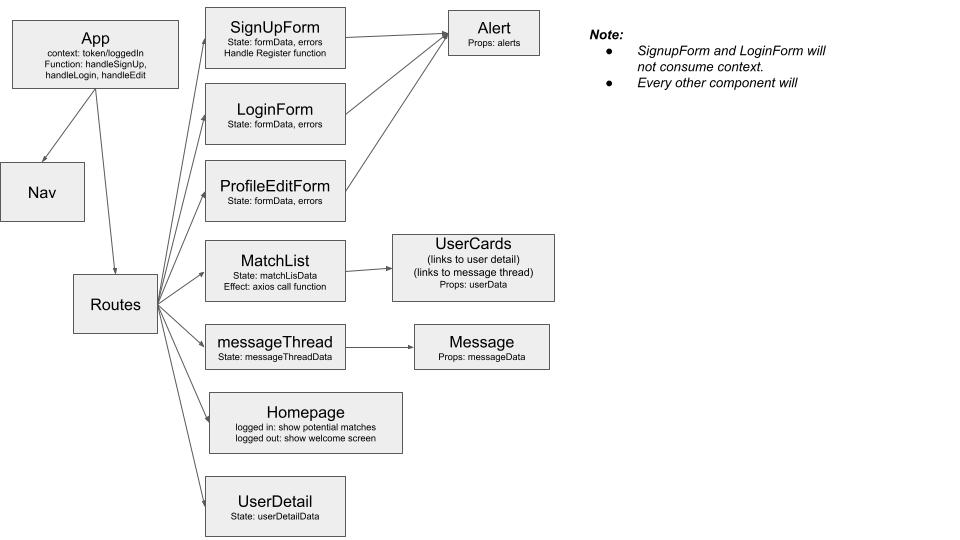

# Friender
Facebook-esk friending website.
- Frontend: React
- Backend: Flask, PostgreSQL

## Features Complete
- Login/Signup
- Users can: 
    - view list of potential matches
    - like and pass on a match

## Getting Up & Running
### Backend
1. Flask Environment Setup
    ```console
    $ python3 -m venv venv
    $ source venv/bin/activate
    (venv) $ pip install -r requirements.txt
    ```
2. Database Setup
    ```console
    $ createdb friender
    $ ipython
    In [1]: %run app.py
    In [2]: db.create_all()
    ```
3. Run the Server
    ```console
    $ flask run
    ```
4. Running Tests
     ```console
    $ jest test
    ```

### Frontend
1. Environment Setup
    ```console
    $ npm install
    ``` 
2. Run the Server
    ```console
    $ npm start
    ```
3. Running Tests
     ```console
    $ jest test
    ```

## Database Models


## React Component Diagram


## Features Outstanding
- Sending direct messages
- Allow admin users

## Dev Roadmap
1. Ensure comprehensive testing (priority: add testing for message model)
2. Make mobile friendly
    - Fix alignment of profile image in a message.
    - Message spacing on mobile
    - Logout button placement on mobile
6. Fix profile picture
7. Optimize SQL Query counts
